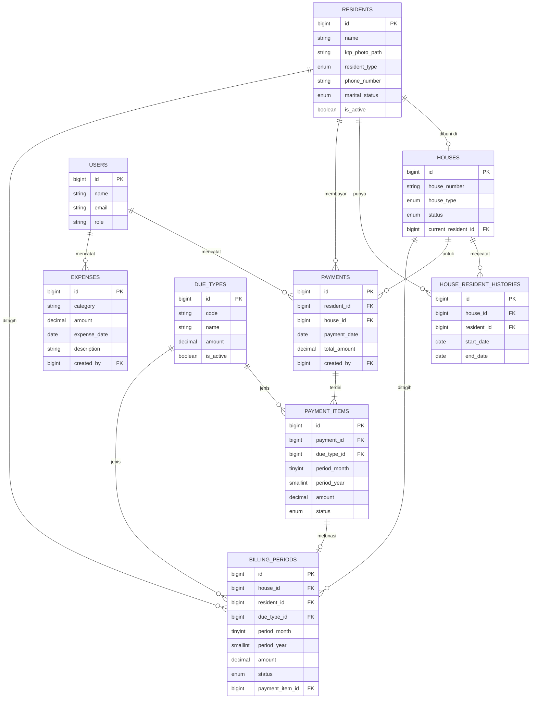

# ERD - Aplikasi Iuran Bulanan Komplek

Diagram ini menggambarkan relasi antar tabel database (MySQL). Bisa dibuka dengan
editor/plugin yang mendukung Mermaid (contoh: ekstensi "Markdown Preview Mermaid Support"
di VS Code), atau ditempel ke https://mermaid.live untuk melihat visualisasinya.

## Penjelasan Relasi Kunci

- **RESIDENTS - HOUSES**: satu rumah punya nol atau satu penghuni aktif (`current_resident_id`). Jika rumah berstatus "dihuni", kolom ini wajib terisi (divalidasi di aplikasi, bukan hanya di database).
- **HOUSE_RESIDENT_HISTORIES**: mencatat setiap kali penghuni sebuah rumah berganti. `end_date` kosong berarti penghuni tersebut masih tinggal sampai sekarang.
- **PAYMENTS - PAYMENT_ITEMS**: satu transaksi pembayaran (`PAYMENTS`) bisa memiliki banyak baris `PAYMENT_ITEMS`, sehingga satu kali bayar bisa mencakup beberapa bulan sekaligus (misalnya bayar kebersihan untuk 12 bulan) dan beberapa jenis iuran sekaligus.
- **BILLING_PERIODS**: tabel "tagihan seharusnya" yang di-generate otomatis tiap bulan hanya untuk rumah berstatus dihuni. Baris ini ditandai lunas dan ditautkan ke `PAYMENT_ITEMS` begitu ada pembayaran yang cocok.
- **EXPENSES**: berdiri sendiri, dipakai untuk kebutuhan laporan saldo (pemasukan dari `PAYMENT_ITEMS` dikurangi pengeluaran dari tabel ini).
