# Dokumentasi Fitur - Aplikasi Iuran Bulanan Kompleks

---

## 1. Kelola Penghuni

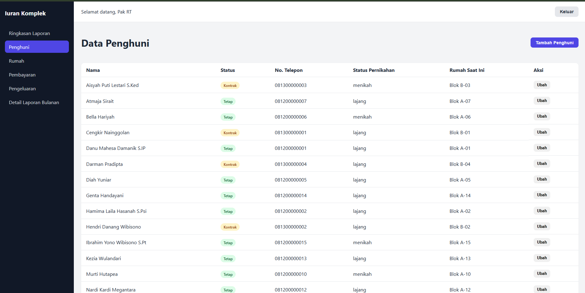
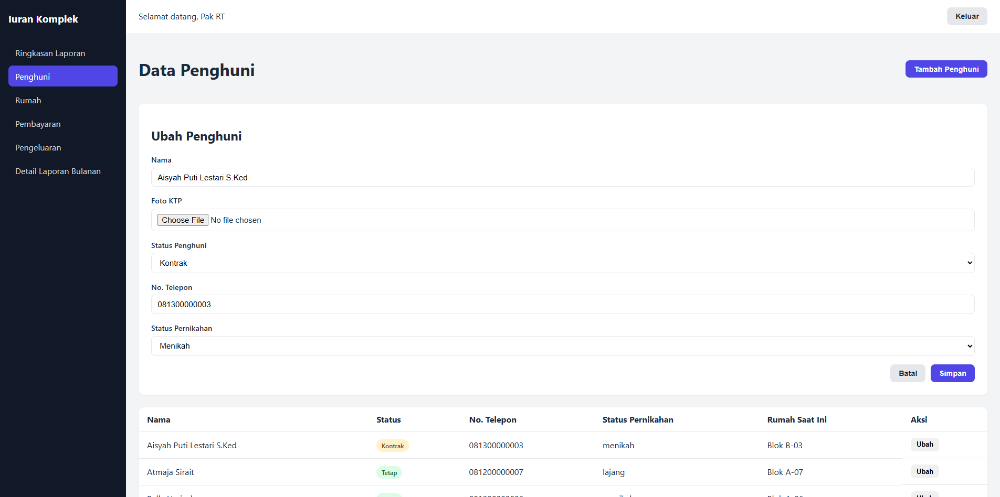
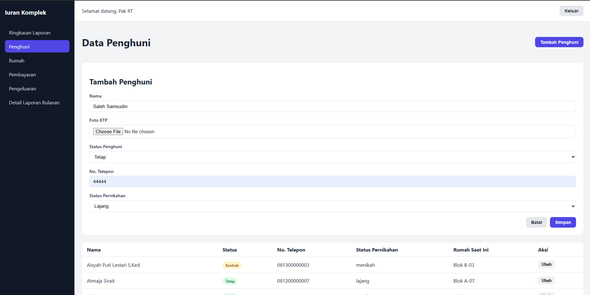

Fitur ini digunakan untuk mencatat data setiap penghuni komplek secara lengkap, mulai dari
nama, foto KTP, status sebagai penghuni tetap atau kontrak, nomor telepon, hingga status
pernikahan (lajang atau menikah), dan data tersebut bisa ditambah maupun diubah kapan saja
lewat satu form yang sama. Sesuai kebutuhan, fitur ini hanya mencakup tambah, lihat, dan
ubah data, tanpa opsi hapus.

Implementasi teknis: ResidentController, StoreResidentRequest,
UpdateResidentRequest di backend; ResidentList.jsx, ResidentForm.jsx di frontend.

## 2. Kelola Rumah dan Riwayat Penghuni

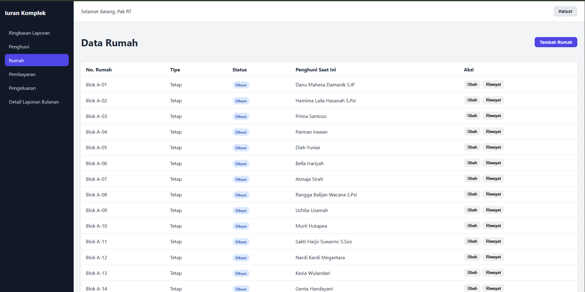
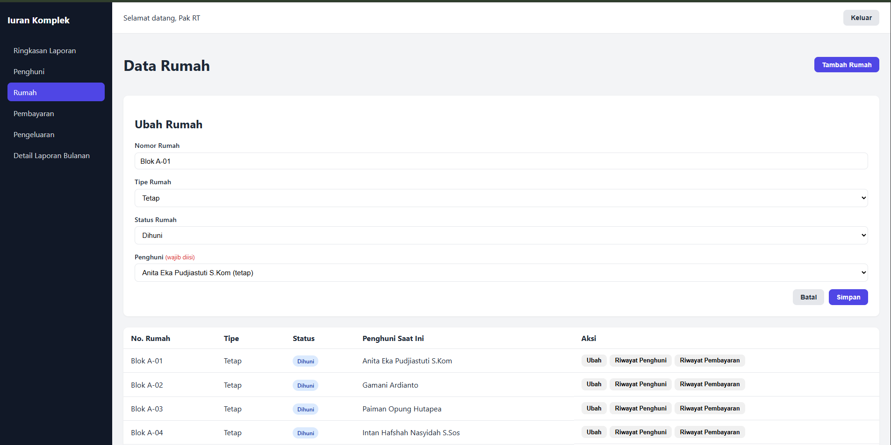
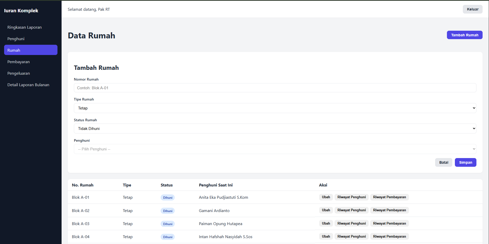

Fitur ini mencatat data setiap rumah di komplek berupa nomor rumah, tipe tetap atau
kontrak, serta status huninya, dan secara otomatis mewajibkan pengisian nama penghuni
setiap kali status rumah diubah menjadi dihuni sehingga tidak mungkin ada rumah berstatus
dihuni tanpa penghuni yang jelas, sekaligus menyimpan riwayat pergantian penghuni dari
waktu ke waktu yang bisa dibuka kembali kapan saja. Data awal 20 rumah (15 tetap + 5
kontrak) sudah tersedia lewat seeder, dan tombol "Tambah Rumah" tetap disediakan untuk
penambahan unit baru di masa depan. Sama seperti data penghuni, fitur ini hanya mencakup
tambah, lihat, dan ubah data, tanpa opsi hapus.

Implementasi teknis: HouseController, endpoint tambahan
GET /houses/{id}/histories di backend; HouseList.jsx, HouseForm.jsx,
HouseHistory.jsx di frontend.

## 3. Pembayaran Iuran

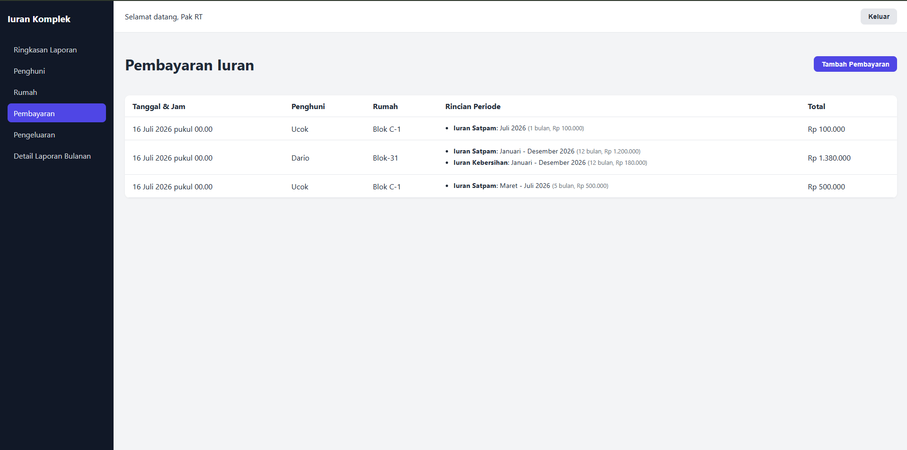
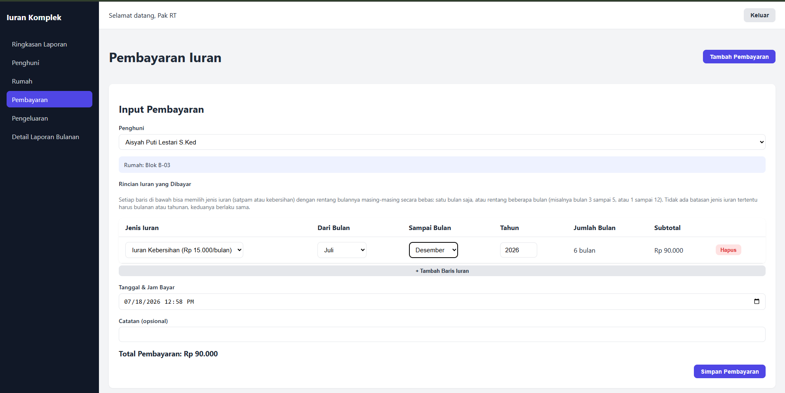

Fitur ini mencatat pembayaran iuran dari penghuni, dengan dua jenis iuran yang sudah
tersedia secara otomatis, yaitu iuran satpam dan iuran kebersihan. Setiap kali input
pembayaran, admin bisa menambahkan beberapa baris rincian sekaligus, di mana masing-masing
baris bebas memilih jenis iuran serta rentang bulan pembayarannya sendiri, sehingga
penghuni bisa membayar satu bulan saja atau sekaligus untuk rentang beberapa bulan seperti
satu tahun penuh, baik untuk iuran satpam maupun kebersihan tanpa ada batasan salah satu
harus bulanan atau tahunan. Pada daftar pembayaran, rentang bulan yang berurutan otomatis
diringkas jadi satu baris (misalnya "Januari - Desember 2026") supaya tidak menumpuk
menjadi puluhan baris terpisah.

Implementasi teknis: PaymentService, PaymentController di backend; PaymentForm.jsx, PaymentList.jsx,
paymentPeriods.js di frontend.

## 4. Pengeluaran

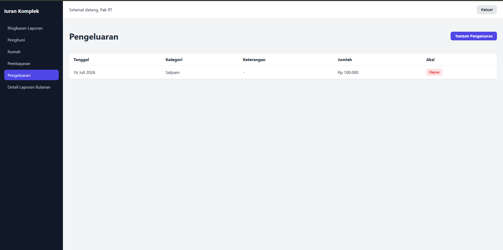

Fitur ini mencatat pengeluaran operasional komplek seperti gaji satpam atau pembelian alat
kebersihan, yang nantinya menjadi pembanding terhadap data pemasukan pada halaman laporan
untuk menghitung sisa saldo yang sebenarnya.

## 5. Laporan Ringkasan (Grafik 1 Tahun)

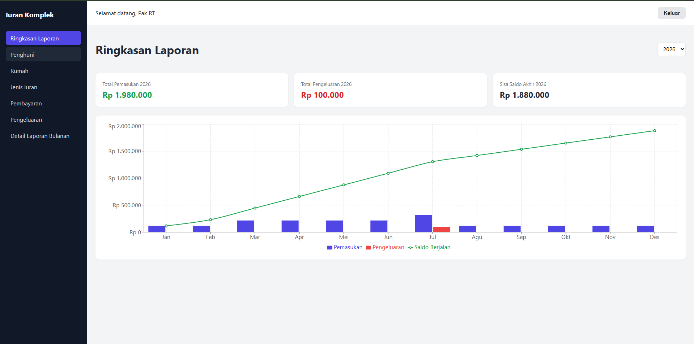

Halaman ini menampilkan ringkasan pemasukan, pengeluaran, dan sisa saldo untuk satu tahun
penuh dalam bentuk grafik, sehingga tren keuangan komplek per bulan beserta saldo yang
terus berjalan dari bulan ke bulan bisa langsung terlihat tanpa perlu membuka data mentah
satu per satu.

Implementasi teknis: ReportService::yearlySummary(), endpoint
GET /reports/summary?year=2026 di backend; SummaryDashboard.jsx dengan
MonthlyBalanceChart.jsx (Recharts) di frontend.

## 6. Detail Laporan Bulanan

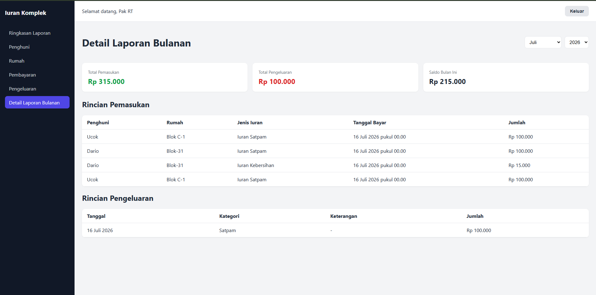

Halaman ini menampilkan rincian lengkap pemasukan, yaitu siapa yang membayar, rumah mana,
dan jenis iuran apa, beserta rincian pengeluaran pada bulan tertentu yang dipilih, sehingga
memudahkan penelusuran detail transaksi di bulan tersebut kapan pun dibutuhkan.

Implementasi teknis: ReportService::monthlyDetail(), endpoint
GET /reports/monthly-detail?month=7&year=2026 di backend; MonthlyDetailReport.jsx di
frontend.

## 7. Login dan Keamanan Akses

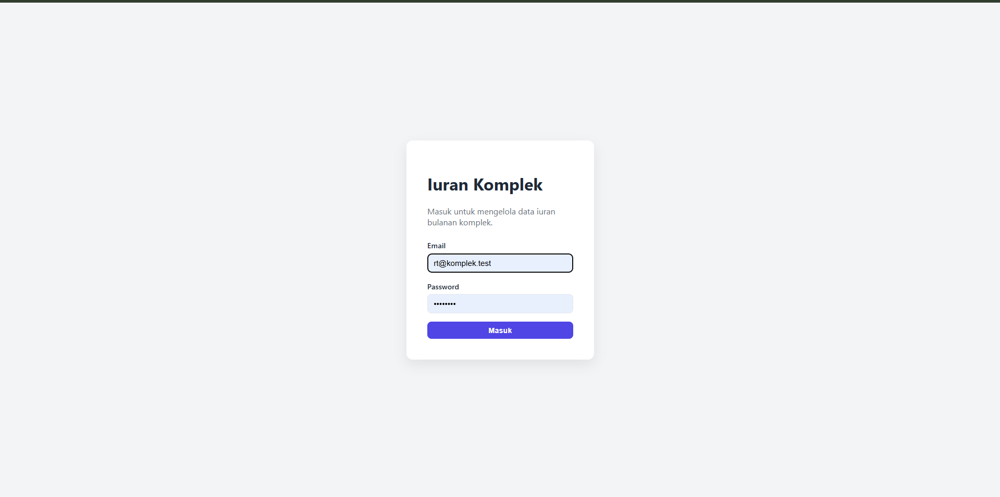

Akses ke aplikasi dilindungi dengan sistem login berbasis token, sehingga hanya pengguna
yang memiliki akun, seperti Pak RT atau bendahara, yang bisa masuk dan mengelola data,
dengan setiap permintaan data dari aplikasi wajib menyertakan token login yang sah.

Implementasi teknis: AuthController di backend; AuthContext.jsx, useAuth.js,
PrivateRoute.jsx di frontend.
